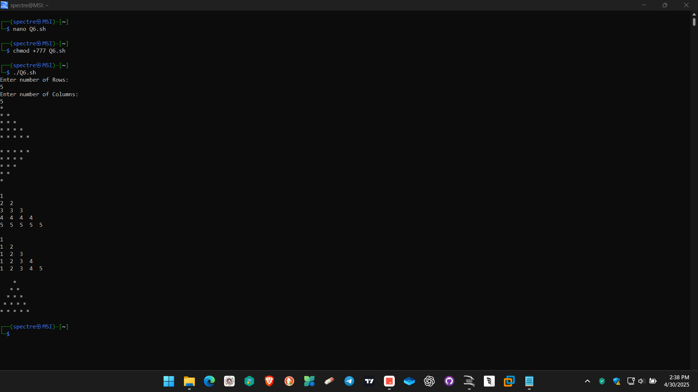
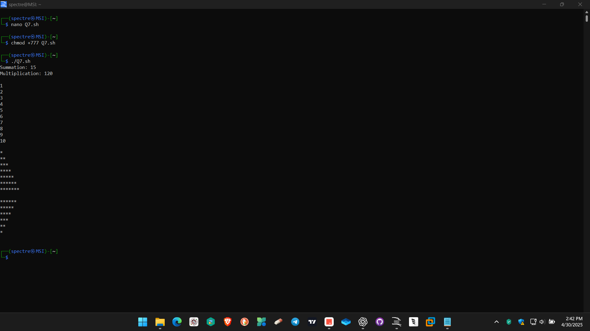

# Operating System Course - Day 05

[](https://learn.microsoft.com/en-us/windows-server/administration/windows-commands/windows-commands)
[](https://www.microsoft.com/windows)
[]()
[]()

> 📚 A comprehensive collection of daily practical lessons for Operating System course focusing on shell scripting.

## 📋 Course Overview

This repository contains practical exercises and implementations for the Operating System course. Each lesson is organized with shell scripts and their corresponding outputs.

## 🗓️ Day 05 Content

### 🎯 Learning Materials

#### 1. Astrology Calculator
- Calculates life path number from birth date
- Uses switch case for horoscope interpretation
- Example output shows interpretation for different numbers

#### 2. Number Operations
- Calculates sum and multiplication of a list of numbers
- Demonstrates use of for loop in shell scripting
- Example shows operations on numbers 1-5

#### 3. Integer Counter
- Prints integers from 1 to 10
- Implements while loop functionality
- Shows basic loop control structure

#### 4. Pattern Generation
- Multiple pattern implementations using nested loops
- Demonstrates different star and number patterns
- Includes ascending and descending patterns

### 📊 Implementation Structure

| Pattern | Description | Visual Output |
|---------|-------------|---------------|
| Pattern 1 | Ascending star pattern |  |
| Pattern 2 | Descending star pattern |  |

### 🔍 Code Examples and Explanations

#### 1. Life Path Calculator
```bash
# Get birth date input from user
echo "Enter the birth date: "
read date

# Calculate life path number
a=$(($date%10))    # Get last digit
b=$(($date/10))    # Get first digit(s)
c=$(($a+$b))       # Sum digits for life path number

# Interpret life path number using switch case
case $c in
        1)echo "Lucky";;             # Path of leadership
        2)echo "Carefuly do your work";; # Path of cooperation
        3)echo "Strange";;           # Path of creativity
        4)echo "Happy";;             # Path of stability
        5)echo "Can get help";;      # Path of freedom
        6)echo "Doubt";;             # Path of responsibility
        7)echo "sad";;               # Path of analysis
        8)echo "Like";;              # Path of authority
        9)echo "Courage";;           # Path of wisdom
esac
```
This script demonstrates:
- User input handling
- Basic arithmetic operations
- Modulo operation for digit extraction
- Switch case implementation for multiple conditions
- Simple numerology interpretation

#### 2. Number Operations with For Loop
```bash
# Initialize variables
sum=0
mul=1

# Iterate through numbers 1 to 5
for num in 1 2 3 4 5
do
    sum=$(($sum+$num))  # Add current number to sum
    mul=$(($mul*$num))  # Multiply current number with product
done

# Display results
echo "Summation:$sum"
echo "Multiplication:$mul"
```
This script showcases:
- Variable initialization
- For loop implementation
- Arithmetic operations in shell
- Cumulative calculations
- Parameter iteration

#### 3. Integer Counter with While Loop
```bash
let i=1  # Initialize counter
while [ $i -le 10 ]  # Continue while i <= 10
do
    echo $i         # Print current number
    i=$(($i+1))    # Increment counter
done
```
This script illustrates:
- While loop structure
- Conditional testing
- Counter implementation
- Numeric comparison
- Variable increment

#### 4. Pattern Generation Scripts
```bash
# Pattern 1: Ascending Star Pattern
for((i=1;i<=7;i++))
do
    for((j=1;j<=i;j++))
    do
        echo -n "*"  # Print star without newline
    done
    echo ""  # Move to next line
done

# Pattern 2: Descending Star Pattern
for((i=1;i<=7;i++))
do
    for((j=7;j>i;j--))
    do
        echo -n "*"  # Print star without newline
    done
    echo ""  # Move to next line
done
```
These patterns demonstrate:
- Nested loop implementation
- Pattern logic using loops
- Output formatting
- Counter manipulation
- String concatenation

### 🔍 Technical Notes

- All implementations are in Shell Script
- Each script includes comprehensive command demonstrations
- Visual outputs are captured for reference
- Consistent script formatting and naming conventions

---

<div align="center">

📖 **Learning Path** | 🛠️ **Practical Examples** | 📊 **Visual Outputs**

</div>
